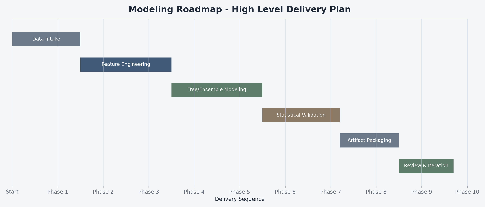
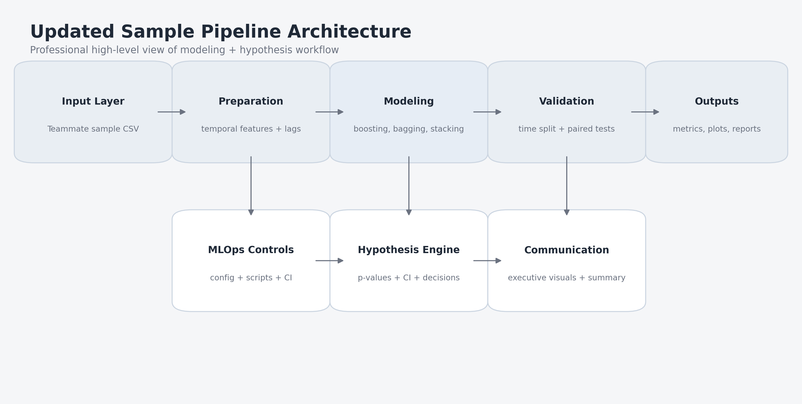
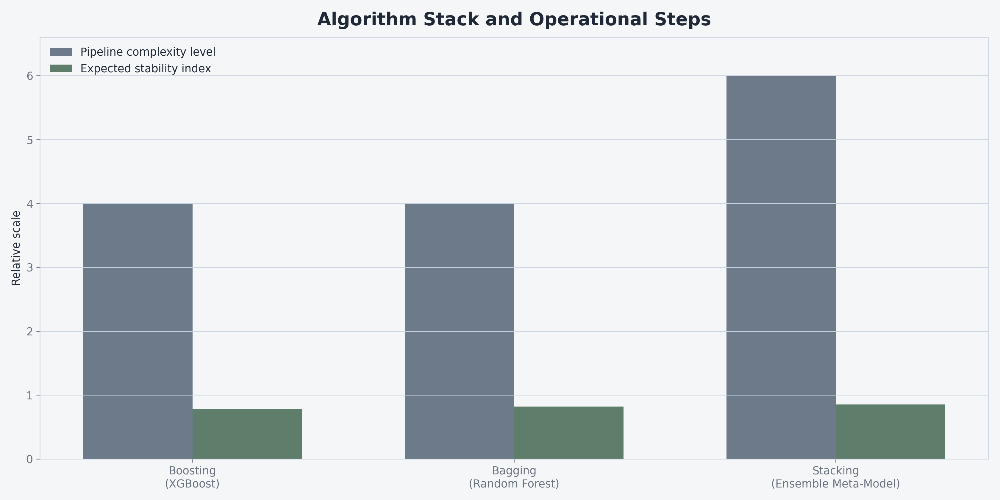
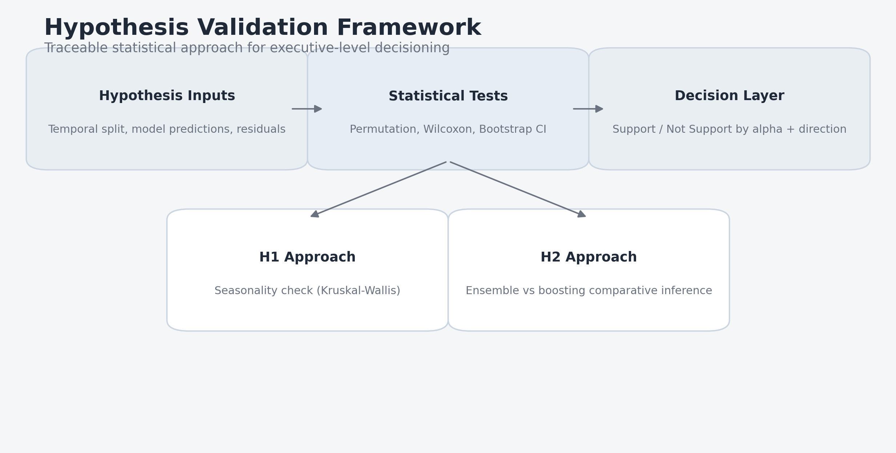

# Executive Visual Summary

This document consolidates the high-level professional visuals for the updated sample modeling project.

## 1) Modeling Roadmap



## 2) Pipeline Architecture



## 3) Algorithms and Steps Overview



## 4) Hypothesis Approach Framework



## Notes

- Palette is intentionally muted and presentation-safe.
- Visuals are generated by `scripts/generate_executive_visuals.py`.
- To regenerate:

```bash
cd updated_GITHUB_sample_code
python scripts/generate_executive_visuals.py
```
